tutorial\_draft
================

Evaluating Hyperparameter Tuning
================================

As mentioned in the Tuning tutorial, tuning a machine learning algorithm typically involves:

-   the hyperparameter search space:

``` r
# ex: create a search space for the C hyperparameter from 0.01 to 0.1
ps = makeParamSet(
  makeNumericParam("C", lower = 0.01, upper = 0.1)
)
```

-   the optimization algorithm:

``` r
# ex: random search with 100 iterations
ctrl = makeTuneControlRandom(maxit = 100L)
```

-   an evaluation method, i.e., a resampling strategy and a performance measure:

``` r
# ex: 2-fold CV
rdesc = makeResampleDesc("CV", iters = 2L)
```

After tuning, you may want to evaluate the tuning process in order to answer questions such as:

-   How does varying the value of a hyperparameter change the performance of the machine learning algorithm?
-   What's the relative importance of each hyperparameter?
-   How did the optimization algorithm (prematurely) converge?

mlr provides methods to generate and plot the data in order to evaluate the effect of hyperparameter tuning

Generating hyperparameter tuning data
-------------------------------------

mlr separates the generation of the data from the plotting of the data in case the user wishes to use the data in a custom way downstream.

The `generateHyperParsEffectData` method takes the tuning result along with 2 additional arguments: trafo and include.diagnostics. The trafo arg will convert the hyperparameter data to be on the transformed scale in case a trafo was used when creating the parameter (as in the case below). The include.diagnostics arg will tell mlr whether to include the eol and any error messages from the learner.

In the example below, we perform random search on the C parameter for SVM on the famous Pima Indians dataset. We generate the hyperparameter effect data so that the C parameter is on the transformed scale and we do not include diagnostic data.

``` r
ps = makeParamSet(
  makeNumericParam("C", lower = -5, upper = 5, trafo = function(x) 2^x)
)
ctrl = makeTuneControlRandom(maxit = 100L)
rdesc = makeResampleDesc("Holdout")
res = tuneParams("classif.ksvm", task = pid.task, control = ctrl, 
           measures = list(acc, mmce), resampling = rdesc, par.set = ps, 
           show.info = F)
generateHyperParsEffectData(res, trafo = T, include.diagnostics = F)
```

    ## HyperParsEffectData:
    ## Hyperparameters: C
    ## Measures: acc.test.mean,mmce.test.mean
    ## Optimizer: TuneControlRandom
    ## Nested CV Used: FALSE
    ## [1] "Partial dependence generated"
    ## Snapshot of $data:
    ##            C acc.test.mean mmce.test.mean iteration exec.time
    ## 1 0.12832648     0.7148438      0.2851562         1     0.034
    ## 2 1.09789944     0.7070312      0.2929688         2     0.022
    ## 3 0.05462957     0.6562500      0.3437500         3     0.023
    ## 4 2.71591622     0.7070312      0.2929688         4     0.024
    ## 5 0.73231680     0.7187500      0.2812500         5     0.021
    ## 6 1.81359088     0.7070312      0.2929688         6     0.022

In the example below, we perform grid search on the C parameter for SVM on the famous Pima Indians dataset using nested cross validation. We generate the hyperparameter effect data so that the C parameter is on the untransformed scale and we do not include diagnostic data. As you can see below, nested cross validation is supported without any extra work by the user, allowing the user to obtain an unbiased estimator for the performance.

``` r
ps = makeParamSet(
  makeNumericParam("C", lower = -5, upper = 5, trafo = function(x) 2^x)
)
ctrl = makeTuneControlGrid()
rdesc = makeResampleDesc("Holdout")
lrn = makeTuneWrapper("classif.ksvm", control = ctrl, 
           measures = list(acc, mmce), resampling = rdesc, par.set = ps, 
           show.info = F)
res = resample(lrn, task = pid.task, resampling = cv2, extract = getTuneResult)
generateHyperParsEffectData(res)
```

    ## HyperParsEffectData:
    ## Hyperparameters: C
    ## Measures: acc.test.mean,mmce.test.mean
    ## Optimizer: TuneControlGrid
    ## Nested CV Used: TRUE
    ## [1] "Partial dependence generated"
    ## Snapshot of $data:
    ##            C acc.test.mean mmce.test.mean iteration exec.time
    ## 1 -5.0000000     0.6796875      0.3203125         1     0.016
    ## 2 -3.8888889     0.6796875      0.3203125         2     0.015
    ## 3 -2.7777778     0.7343750      0.2656250         3     0.016
    ## 4 -1.6666667     0.7187500      0.2812500         4     0.015
    ## 5 -0.5555556     0.7109375      0.2890625         5     0.015
    ## 6  0.5555556     0.7812500      0.2187500         6     0.015
    ##   nested_cv_run
    ## 1             1
    ## 2             1
    ## 3             1
    ## 4             1
    ## 5             1
    ## 6             1

After generating the hyperparameter effect data, the next step is to visualize it. mlr has several methods built-in to visualize the data, meant to support the needs of the researcher and the engineer in industry. The next few sections will walk through the visualization support for several usecases.

Visualizing the effect of a single hyperparameter
-------------------------------------------------

In a situation when the user is tuning a single hyperparameter for a learner, the user may wish to plot the performance of the learner against the values of the hyperparameter.

In the example below, we tune the number of clusters against the silhouette score on the Pima dataset. We specify the x-axis with the x arg and the y-axis with the y arg. If the plot.type arg is not specified, mlr will attempt to plot a scatterplot by default. Since `plotHyperParsEffect` returns a `ggplot2` object, we can easily customize it to our liking!

``` r
ps = makeParamSet(
  makeDiscreteParam("centers", values = 3:10)
)
ctrl = makeTuneControlGrid()
rdesc = makeResampleDesc("Holdout")
res = tuneParams("cluster.kmeans", task = mtcars.task, control = ctrl, 
           measures = silhouette, resampling = rdesc, par.set = ps, 
           show.info = F)
data = generateHyperParsEffectData(res)
plt = plotHyperParsEffect(data, x = "centers", y = "silhouette.test.mean")
# add our own touches to the plot
plt + geom_point(colour = "red") + 
  ggtitle("Evaluating Number of Cluster Centers on mtcars") + 
  scale_x_continuous(breaks = 3:10) +
  theme_bw()
```

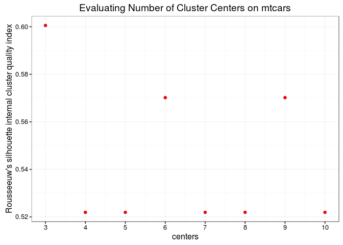

In the example below, we tune SVM with the C hyperparameter on the Pima dataset. We will use simulated annealing optimizer, so we are interested in seeing if the optimization algorithm actually improves with iterations. By default, mlr only plots improvements to the global optimum.

``` r
ps = makeParamSet(
  makeNumericParam("C", lower = -5, upper = 5, trafo = function(x) 2^x)
)
ctrl = makeTuneControlGenSA(budget = 100L)
rdesc = makeResampleDesc("Holdout")
res = tuneParams("classif.ksvm", task = pid.task, control = ctrl, 
                 resampling = rdesc, par.set = ps, show.info = F)
data = generateHyperParsEffectData(res)
plt = plotHyperParsEffect(data, x = "iteration", y = "mmce.test.mean",
               plot.type = "line")
plt + ggtitle("Analyzing convergence of simulated annealing") +
  theme_minimal()
```

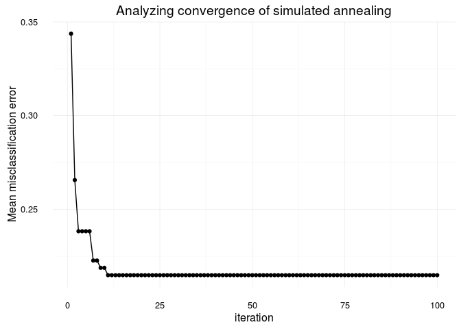

In the case of a learner crash, mlr will impute the crash with the worst value graphically and indicate the point. In the example below, we give the C parameter negative values, which will result in a learner crash for SVM.

``` r
ps = makeParamSet(
  makeDiscreteParam("C", values = c(-1, -0.5, 0.5, 1, 1.5))
)
ctrl = makeTuneControlGrid()
rdesc = makeResampleDesc("CV", iters = 2L)
res = tuneParams("classif.ksvm", task = pid.task, control = ctrl, 
           measures = list(acc, mmce), resampling = rdesc, par.set = ps, 
           show.info = F)
data = generateHyperParsEffectData(res)
plt = plotHyperParsEffect(data, x = "C", y = "acc.test.mean")
plt + ggtitle("SVM learner crashes with negative C") +
  theme_bw()
```

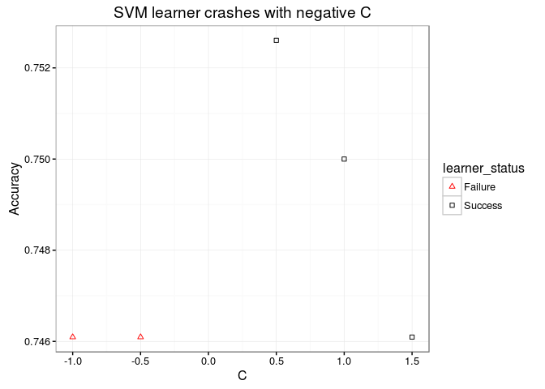

The example below uses nested cross validation with an outer loop of 2 runs. mlr indicates each run within the visualization.

``` r
ps = makeParamSet(
  makeNumericParam("C", lower = -5, upper = 5, trafo = function(x) 2^x)
)
ctrl = makeTuneControlGrid()
rdesc = makeResampleDesc("Holdout")
lrn = makeTuneWrapper("classif.ksvm", control = ctrl, 
           measures = list(acc, mmce), resampling = rdesc, par.set = ps, 
           show.info = F)
res = resample(lrn, task = pid.task, resampling = cv2, extract = getTuneResult)
data = generateHyperParsEffectData(res)
plotHyperParsEffect(data, x = "C", y = "acc.test.mean", 
               plot.type = "line")
```

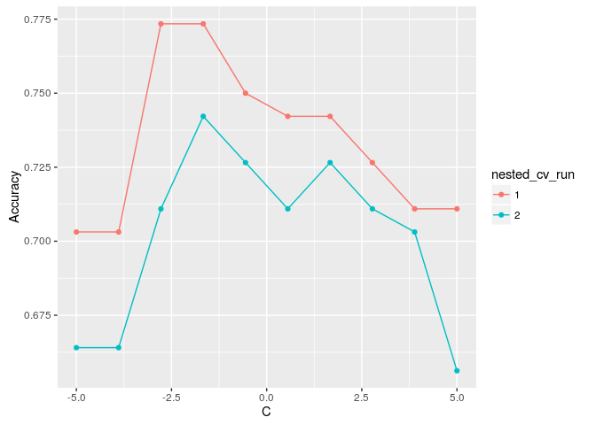

Visualizing the effect of 2 hyperparameters
-------------------------------------------

In the case of tuning 2 hyperparameters simultaneously, mlr provides the ability to plot a heatmap and contour plot in addition to a scatterplot or line.

In the example below, we tune the C and sigma parameters for SVM on the Pima dataset. We use interpolation to produce a regular grid for plotting the heatmap. The interpolation arg accepts any regression learner from mlr to perform the interpolation. The z arg will be used to fill the heatmap or color lines, depending on the `plot.type` used.

``` r
ps = makeParamSet(
  makeNumericParam("C", lower = -5, upper = 5, trafo = function(x) 2^x),
  makeNumericParam("sigma", lower = -5, upper = 5, trafo = function(x) 2^x))
ctrl = makeTuneControlRandom(maxit = 100L)
rdesc = makeResampleDesc("Holdout")
learn = makeLearner("classif.ksvm", par.vals = list(kernel = "rbfdot"))
res = tuneParams(learn, task = pid.task, control = ctrl, measures = acc,
                 resampling = rdesc, par.set = ps, show.info = F)
data = generateHyperParsEffectData(res)
plt = plotHyperParsEffect(data, x = "C", y = "sigma", z = "acc.test.mean",
                    plot.type = "heatmap", interpolate = "regr.earth")
min_plt = min(data$data$acc.test.mean, na.rm = TRUE)
max_plt = max(data$data$acc.test.mean, na.rm = TRUE)
med_plt = mean(c(min_plt, max_plt))
plt + scale_fill_gradient2(breaks = seq(min_plt, max_plt, length.out = 5), 
                           low = "blue", mid = "white", high = "red", 
                           midpoint = med_plt)
```

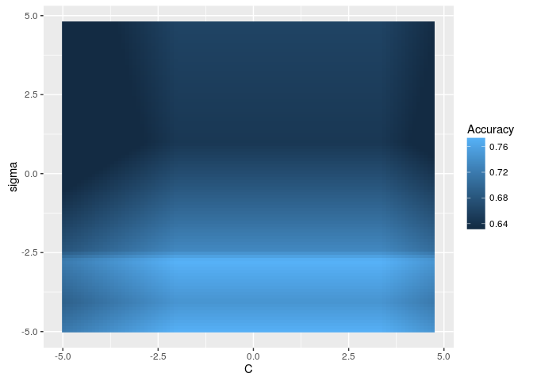

We can use the show.experiments arg in order to visualize which points were specifically passed to the learner in the original experiment and which points were interpolated by mlr:

``` r
plt = plotHyperParsEffect(data, x = "C", y = "sigma", z = "acc.test.mean",
                    plot.type = "heatmap", interpolate = "regr.earth", 
                    show.experiments = TRUE)
plt + scale_fill_gradient2(breaks = seq(min_plt, max_plt, length.out = 5), 
                           low = "blue", mid = "white", high = "red", 
                           midpoint = med_plt)
```

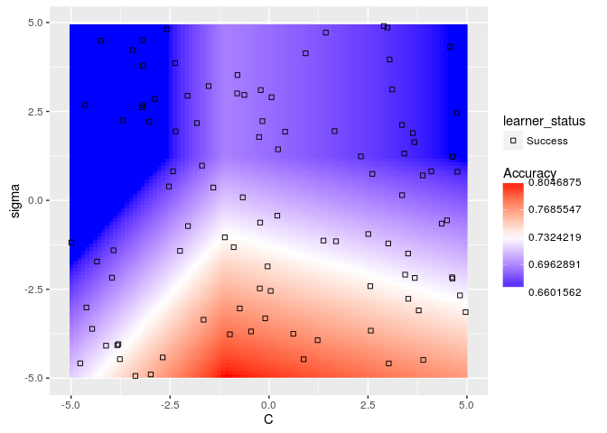

We can also visualize how long the optimizer takes to reach an optima for the same example:

``` r
plotHyperParsEffect(data, x = "iteration", y = "acc.test.mean", 
                    plot.type = "line")
```

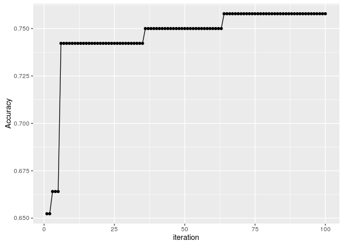

In the case where we are tuning 2 hyperparameters and we have a learner crash, mlr will indicate the respective points and impute them with the worst value. In the example below, we tune C and sigma, forcing C to be negative for some instances which will crash SVM. We perform interpolation to get a regular grid in order to plot a heatmap. We can see that the interpolation creates axis parallel lines resulting from the learner crashes.

``` r
ps = makeParamSet(
  makeDiscreteParam("C", values = c(-1, 0.5, 1.5, 1, 0.2, 0.3, 0.4, 5)),
  makeDiscreteParam("sigma", values = c(-1, 0.5, 1.5, 1, 0.2, 0.3, 0.4, 5)))
ctrl = makeTuneControlGrid()
rdesc = makeResampleDesc("Holdout")
learn = makeLearner("classif.ksvm", par.vals = list(kernel = "rbfdot"))
res = tuneParams(learn, task = pid.task, control = ctrl, measures = acc,
                 resampling = rdesc, par.set = ps, show.info = F)
data = generateHyperParsEffectData(res)
plotHyperParsEffect(data, x = "C", y = "sigma", z = "acc.test.mean",
                    plot.type = "heatmap", interpolate = "regr.earth")
```

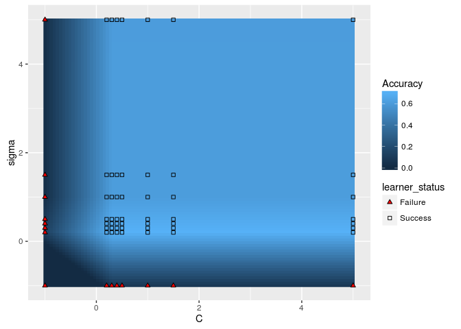

A slightly more complicated example is using nested cross validation while simultaneously tuning 2 hyperparameters. In order to plot a heatmap in this case, mlr will aggregate each of the nested runs by a user-specified function. The default function is mean. As expected, we can still take advantage of interpolation.

``` r
ps = makeParamSet(
  makeNumericParam("C", lower = -5, upper = 5, trafo = function(x) 2^x),
  makeNumericParam("sigma", lower = -5, upper = 5, trafo = function(x) 2^x))
ctrl = makeTuneControlRandom(maxit = 100)
rdesc = makeResampleDesc("Holdout")
learn = makeLearner("classif.ksvm", par.vals = list(kernel = "rbfdot"))
lrn = makeTuneWrapper(learn, control = ctrl, 
           measures = list(acc, mmce), resampling = rdesc, par.set = ps, 
           show.info = F)
res = resample(lrn, task = pid.task, resampling = cv2, extract = getTuneResult)
data = generateHyperParsEffectData(res)
plt = plotHyperParsEffect(data, x = "C", y = "sigma", z = "acc.test.mean",
                    plot.type = "heatmap", interpolate = "regr.earth", 
                    show.experiments = TRUE, nested.agg = mean)
min_plt = min(plt$data$acc.test.mean, na.rm = TRUE)
max_plt = max(plt$data$acc.test.mean, na.rm = TRUE)
med_plt = mean(c(min_plt, max_plt))
plt + scale_fill_gradient2(breaks = seq(min_plt, max_plt, length.out = 5), 
                           low = "red", mid = "white", high = "blue", 
                           midpoint = med_plt)
```

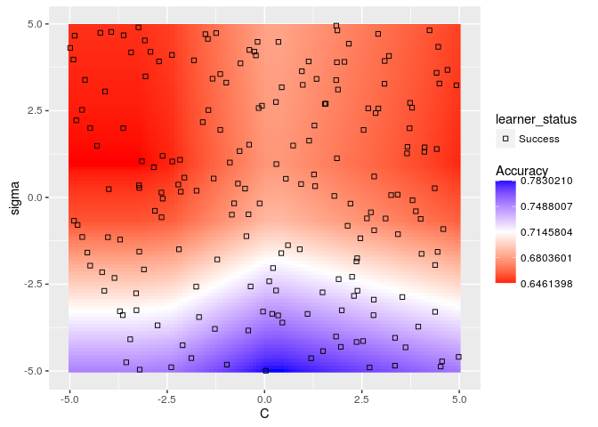

Visualizing the effect of more than 2 hyperparameters
-----------------------------------------------------

In the case of 2+ hyperparameters, the researcher may want to understand the relative importance of each hyperparameter or how each hyperparameter contributes to performance. By converting the hyperparameter effects data to a regression task, we can compute partial dependency and relative importance!

In the example below, we tune SVM with bessel kernel and 3 hyperparameters: C, sigma, degree.

``` r
ps = makeParamSet(
  makeNumericParam("C", lower = -5, upper = 5, trafo = function(x) 2^x),
  makeNumericParam("sigma", lower = -5, upper = 5, trafo = function(x) 2^x),
  makeDiscreteParam("degree", values = 2:5))
ctrl = makeTuneControlRandom(maxit = 100L)
rdesc = makeResampleDesc("Holdout", predict = "both")
learn = makeLearner("classif.ksvm", par.vals = list(kernel = "besseldot"))
res = tuneParams(learn, task = pid.task, control = ctrl, 
  measures = list(acc,setAggregation(acc, train.mean)),
                 resampling = rdesc, par.set = ps, show.info = F)
generateHyperParsEffectData(res)
```

    ## HyperParsEffectData:
    ## Hyperparameters: C,sigma,degree
    ## Measures: acc.test.mean,acc.train.mean
    ## Optimizer: TuneControlRandom
    ## Nested CV Used: FALSE
    ## [1] "Partial dependence generated"
    ## Snapshot of $data:
    ##            C      sigma degree acc.test.mean acc.train.mean iteration
    ## 1 -4.1457644  1.8948733      2     0.6484375      0.6523438         1
    ## 2 -3.5077354 -3.1114005      3     0.6484375      0.6523438         2
    ## 3 -1.2817892 -3.7379709      4     0.6601562      0.6562500         3
    ## 4 -2.8210494 -1.1010886      5     0.7500000      0.7792969         4
    ## 5  1.1966207 -0.3294237      4     0.7265625      0.9179688         5
    ## 6  0.2398466  1.0220886      4     0.6445312      0.9960938         6
    ##   exec.time
    ## 1     0.310
    ## 2     0.123
    ## 3     0.120
    ## 4     0.153
    ## 5     0.168
    ## 6     0.291

Now that we've generated the data, we can create the partial dependency using the `partial.dep` arg:

``` r
data = generateHyperParsEffectData(res, partial.dep = TRUE)
```

Now that we have a partial dependency, we can isolate the partial dep of the `C` hyperparameter:

``` r
plotHyperParsEffect(data, x = "C", y = "acc.test.mean", plot.type = "line")
```

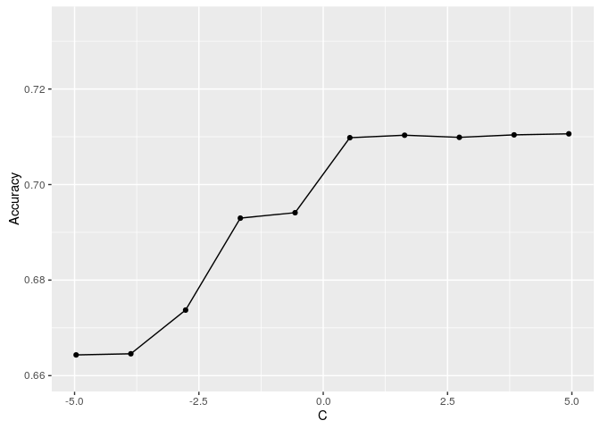

We can also look at bivariate relationships using heatmap or contour:

``` r
plotHyperParsEffect(data, x = "degree", y = "sigma", z = "acc.test.mean", 
  plot.type = "heatmap")
```

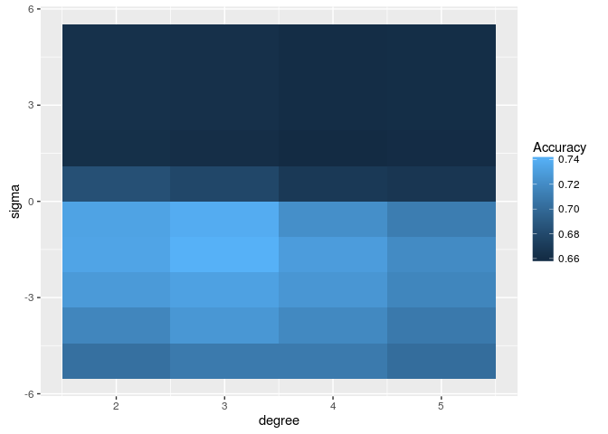

Or a colored scatter:

``` r
plotHyperParsEffect(data, x = "C", y = "acc.test.mean", z = "degree", 
  plot.type = "scatter")
```

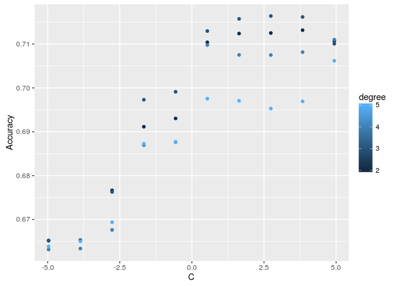

New features
------------

Provide an option so that we can see train/test on the same plot. This is harder to solve than it looks due to cases with nested CV and learner crashes. Naive implementation:

``` r
x = reshape2::melt(data$data,
  id.vars = c(data$hyperparams, "iteration", "exec.time"),
  variable.name = "measure", value.name = "performance")
ggplot(x, aes(x=C, y=performance, color=measure)) + geom_line()
```

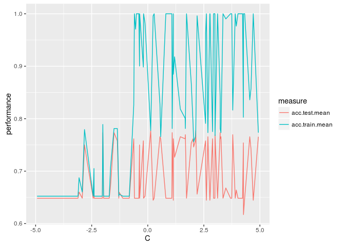

Provide feature importance as a separate function:

``` r
# wrap this in a new function
feat.imp = generateFilterValuesData(data$partial.data[[2]])
plotFilterValues(feat.imp)
```

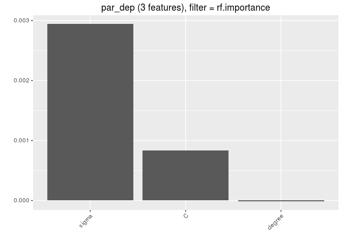
